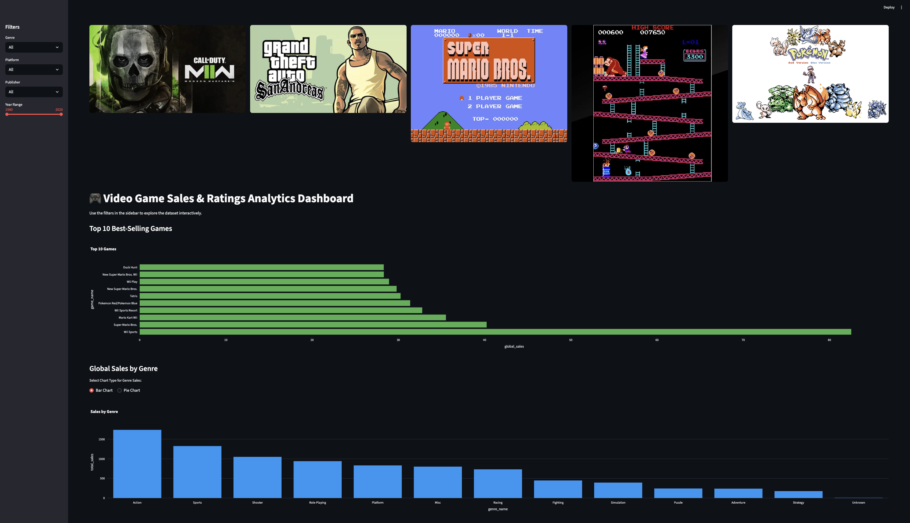
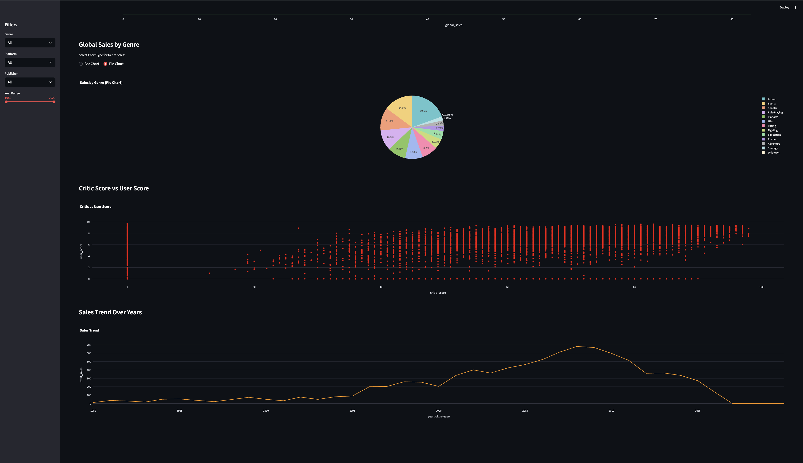
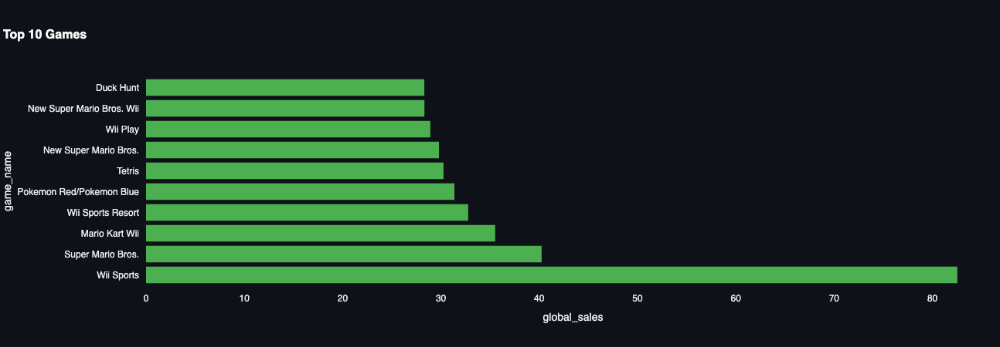
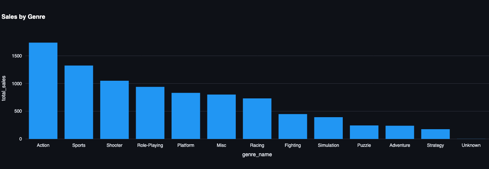
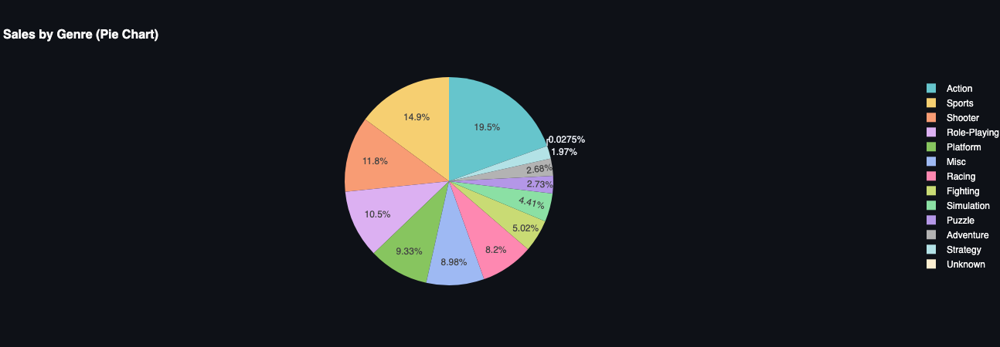
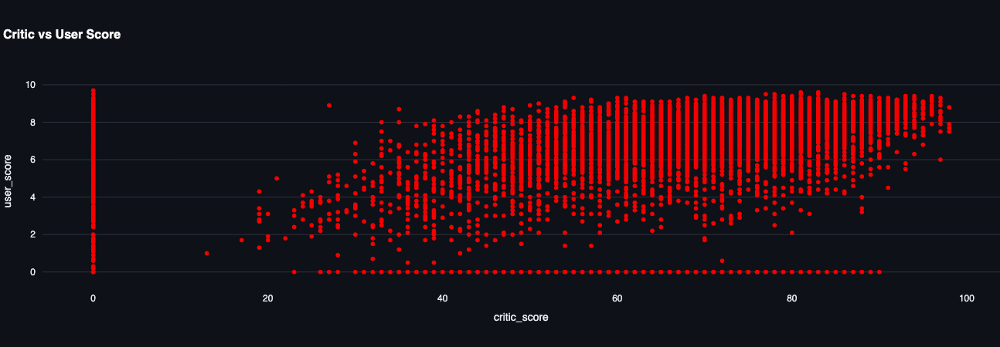
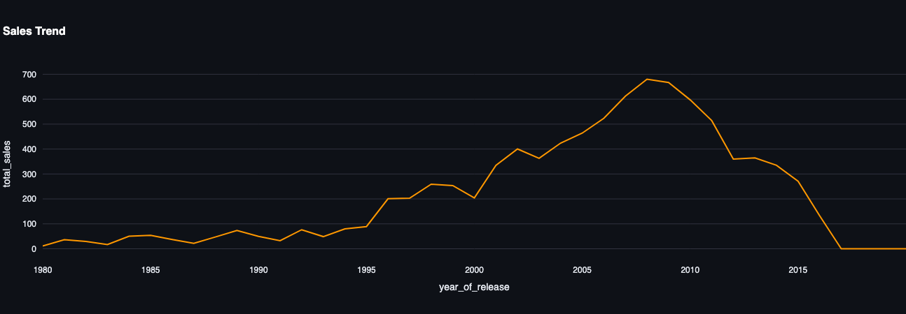
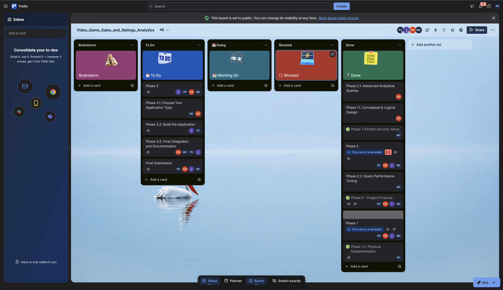

#  Video Game Sales & Ratings Analytics — DMQL Project

### *Final Project README (Setup, Execution Steps, Screenshots, Demo Video Requirements)*

This repository contains the complete implementation of the **DMQL (Data Mining & Query Language)** course project. It includes:

* Phase 1: OLTP schema design, normalization, RBAC, and ingestion preparation.
* Phase 2: Analytical SQL, query performance tuning, and a full dbt-based Data Warehouse.
* Phase 3: A fully interactive Streamlit dashboard connected to OLTP + DW via Docker.

#  1. Project Setup Instructions

Follow these steps to set up the complete environment.

###  1. Clone the Repository

```bash
git clone <https://github.com/prajesh-1003/Video_Game_Sales_and_Ratings_Analytics.git>
cd Video_Game_Sales_and_Ratings_Analytics
```

###  2. Ensure Docker & Docker Compose Are Installed

* Install Docker Desktop from: [https://www.docker.com/products/docker-desktop/](https://www.docker.com/products/docker-desktop/)
* Confirm installation:

```bash
docker --version
docker-compose --version
```

###  3. Project Folder Structure

```
VIDEO_GAME_SALES_AND_RATINGS_ANALYTICS/
│
├── .ipynb_checkpoints/
│
├── app/                                            # Phase 3-Streamlit Application
│   └── streamlit/
│       ├── __pycache__/
│       ├── images/
│       ├── app.py
│       ├── queries.py
│       ├── requirements.txt
│       ├── utils.py
│       └── Dockerfile.streamlit
│
├── data/
│
├── dbt_videogame_dw/                               # Phase 2- Bonus DataWarehousing
│   ├── models/
│   ├── logs/
│   ├── target/
│   ├── dbt_project.yml
│   └── packages.yml (if present)
│
├── dw_sql/
│
├── logs/
│
├── target/
│
├── .gitignore
├── 3NF_Justification_Report.pdf
├── advanced_queries.sql
├── Dimensionalmodeling_and_ETL_Report.pdf
├── docker-compose.yml
├── Dockerfile.dbt
├── Dockerfile.ingestion
├── Dockerfile.jupyter
├── ERD.png
├── ingest_data.ipynb
├── Performance_Tuning_Report.pdf
├── query_performance_tuning.sql
├── requirements.txt
├── schema.sql
├── security.sql
└── Star_Schema.png
```

---

# 2. Execution Instructions (How to Run the Entire Project)

###  1. Start all services (Postgres, pgAdmin, dbt, Jupyter, Streamlit):

```bash
docker-compose up -d
```

This launches:

* PostgreSQL OLTP database
* pgAdmin (DB UI)
* dbt environment
* Jupyter Notebook
* Streamlit Dashboard

###  2. Access the Services**

| Service                 | URL                                            |
| ----------------------- | ---------------------------------------------- |
| **Streamlit Dashboard** | [http://localhost:8501](http://localhost:8501) |
| **pgAdmin**             | [http://localhost:5050](http://localhost:5050) |
| **Jupyter Notebook**    | [http://localhost:9000](http://localhost:9000) |

###  3. Stop all services (data is preserved):

```bash
docker-compose down
```

**Do NOT use:**

```bash
docker-compose down -v
```

This deletes your database volume.

---

# 3. What Each Phase Implements

##  Phase 1 — OLTP Schema, Normalization, RBAC, Ingestion Prep

* Designed a fully normalized 3NF schema for:

  * game, sales, reviews (fact tables)
  * developer, publisher, genre, platform (dimensions)
* Implemented schema in PostgreSQL (`schema.sql`).
* Added PK/FK constraints, enforced referential integrity.
* Created RBAC roles:

  * `analyst_user` → read-only
  * `app_user` → restricted write-only
  * `admin` → complete access
* Prepared ingestion logic in `ingest_data.ipynb`.
* Containerized the entire OLTP environment using Docker.

---

##  Phase 2 — Analytical SQL, Performance Tuning, Data Warehouse (dbt)

* Wrote all required advanced analytical SQL queries.
* Performed performance tuning using `EXPLAIN ANALYZE`.
* Added indexes to optimize a slow query.
* Designed a full **Star Schema** (Fact + Dimensions).
* Implemented a dbt project:

  * Staging models (`stg_*`)
  * Dimension models (`dim_*`)
  * Fact model (`fact_sales`)
* Executed `dbt run` & `dbt test` successfully.
* Populated a clean DW under schema: `dw`.

---

##  Phase 3 — Interactive Streamlit Dashboard (Final Application Layer)

Fully interactive dashboard includes:

### **Filters Sidebar:**

* Genre dropdown
* Platform dropdown
* Publisher dropdown
* Year range slider
* Bar/Pie chart toggle

### **Visualizations:**
1. **Streamlit Dashboard — Full View**




2. **Top 10 Best-Selling Games** 


3. **A. Sales by Genre (Bar chart)** 


3. **B. Sales by Genre (Pie chart)** 


4. **Critic Score vs User Score** 


5. **Global Sales Trend Over Years** 



### **Additional Features:**

* Image banner (5 classic game posters)
* Live connection to OLTP + DW
* Fully dockerized Streamlit app at port 8501

#  4. Demo Video

>  **Demo Video Link:** *Paste Google Drive / YouTube URL here*

---

#  5. Project Mangement

We have used Trello Board for tracking the project progress



>  **Trello Board Link:** *https://trello.com/b/LAb3GSBu/videogamesalesandratingsanalytics*

---

#  6. Final Notes

This project satisfies all deliverables for **Phase 1, Phase 2, and Phase 3**, including:

* Complete OLTP schema
* Data warehouse (dbt)
* Advanced SQL & performance tuning
* Fully interactive BI dashboard
* One-command executable environment via Docker
* Required README with setup, execution, screenshots, and demo video sections


